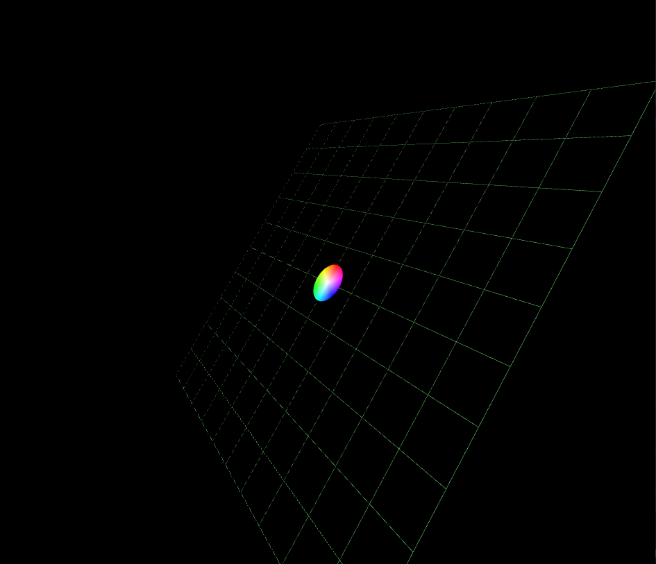

# @roguecircuitry/ez3d

Another minimal webgl lib, written with lots of help from ChatGPT

The library is not ready for any kind of production yet, but feel free to poke around the code if you're interested in learning some webgl



## Example
See [index.ts](./index.ts) for more in depth example

```ts

const gl = canvas.getContext("webgl2");

let shader = new Shader(vertexSrc, fragmentSrc);
shader.createProgram(gl);

//create a mesh with default geometry
//just a triangle to start with
let mesh = new Mesh();
mesh.shader = shader;
mesh.init();

//demo updating mesh data on the fly
setTimeout(() => {

  //similar to mesh constructor, but just updates mesh with new data
  //this time it will be a square
  mesh.vertices = new Float32Array([
    -1, 1, 0,
    -1, -1, 0,
    1, 1, 0,
    1, -1, 0
  ]);
  mesh.indices = new Uint16Array([
    0, 1, 2,
    1, 3, 2
  ]);
  mesh.colors = new Float32Array([
    1, 0, 0, 1,
    0, 1, 0, 1,
    0, 0, 1, 1,
    1, 0, 0, 1
  ]);

  //tell mesh we want to update the GPU with our CPU data
  mesh.updateVertexData(gl);

}, 5000);

function render() {
  //set the clear color
  gl.clearColor(0.0, 0.0, 0.0, 1.0);
  // Clear the canvas
  gl.clear(gl.COLOR_BUFFER_BIT);

  //Tell mesh to render with its shader
  mesh.draw(gl);

  //keep drawing more frames plz
  requestAnimationFrame(render);
}

//start the render loop
requestAnimationFrame(render);

```

## Implemented
### Render helpers
- [Mesh](./src/mesh.ts) - bare bones interface, handles sync between CPU and GPU data
- [Shader](./src/shader.ts) - bare bones shader, will be extended later to make dynamic shader compilation
- [MeshBuilder](./src/meshbuilder.ts) - basic mesh data generation
### Math
- [vector](./src/math/vector.ts) - vector math
- [quaternion](./src/math/quaternion.ts) - minimal quaternion math
- [matrix](./src/math/matrix.ts) - mat4 math
- [color](./src/math/color.ts) - minimal color math
### Scene Graph
- [node](./src/graph/node.ts) - generic empty object, has children, global and local transforms, render recursion
- [scenenode](./src/graph/scene.ts) - provides render()
- [camera](./src/graph/camera.ts) - ortho and perspective all-in-one camera node
- [meshnode](./src/graph/meshnode.ts) - render a mesh as a node automatically

## Building
1. Clone the project -> `git clone https://github.com/roguecircuitry/ez3d`
2. Install dev deps -> `cd ez3d` , `npm install`
3. Build -> `npm run build`
4. Serve to browser from root directory

Looking for an alternative to 'serve'? Try [@repcomm/sserve](https://github.com/RepComm/sserve)

## Dev Dependencies
- [babel](https://github.com/babel/babel) for TypeScript compilation
- [guybedford/es-module-shims](https://github.com/guybedford/es-module-shims)  for HTML import map polyfill
- [@roguecircuitry/htmless](https://github.com/RogueCircuitry/htmless) for UI creation

## Dependencies
None yet

